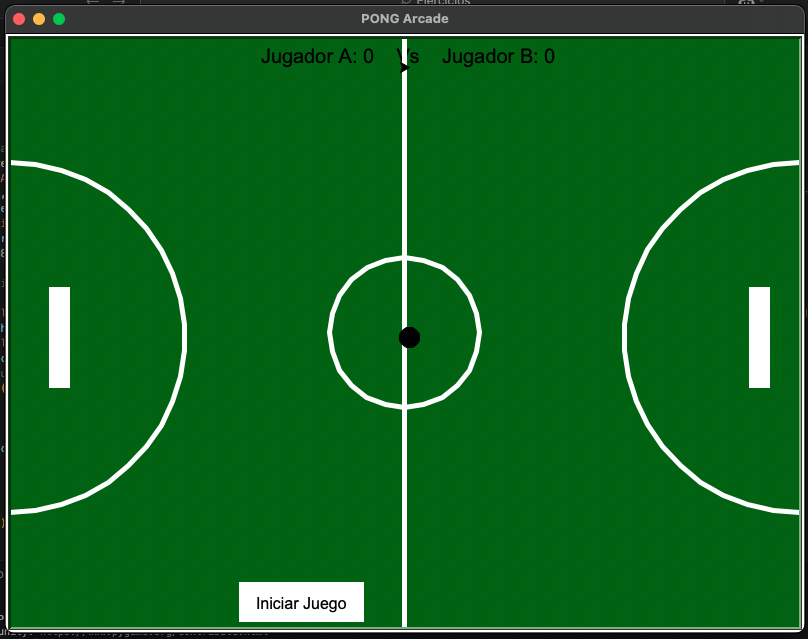

# Pong_arcade
Réplica del mítico juego de los años 70' "Pong". Comparte las bases y mismas reglas del juego
* 🆚 Hecho para el juego 1 Vs 1 desde el mismo dispositivo.
* 🏆 Dispone de un marcador arriba de la pista de juego.
* ⚽️ Botón de reinicio una vez uno de os jugadores haya ganado.
* 🦚 Diferentes colores de la pista de juego cada nueva partida.
* 🔈 Sonido de la pelota al rebotar.

## Comandos

* Player 1  Arriba: "w" - Abajo: "s"
* Player 2  Arriba: "⬆️" - Abajo: "⬇️"

## Librerias

Implementación de las siguientes librerías:
* Turtle
* Time
* Pygame
* Random

# 🖼️ Imagen Pong

# ✉️ Contacto
mactoscan@gmail.com
